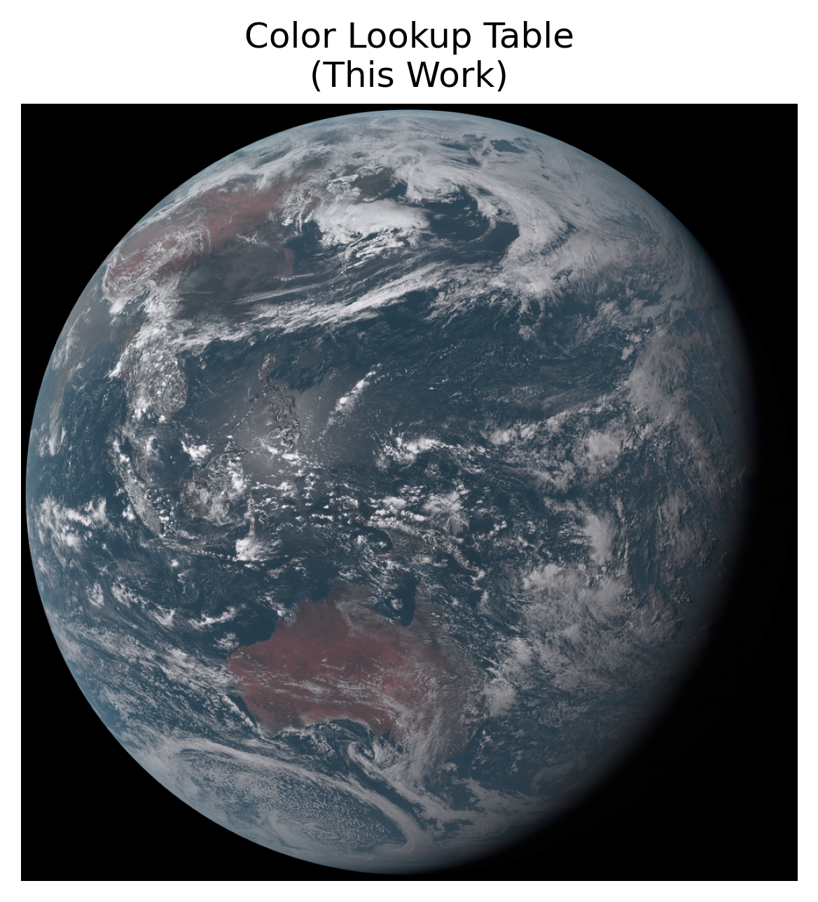
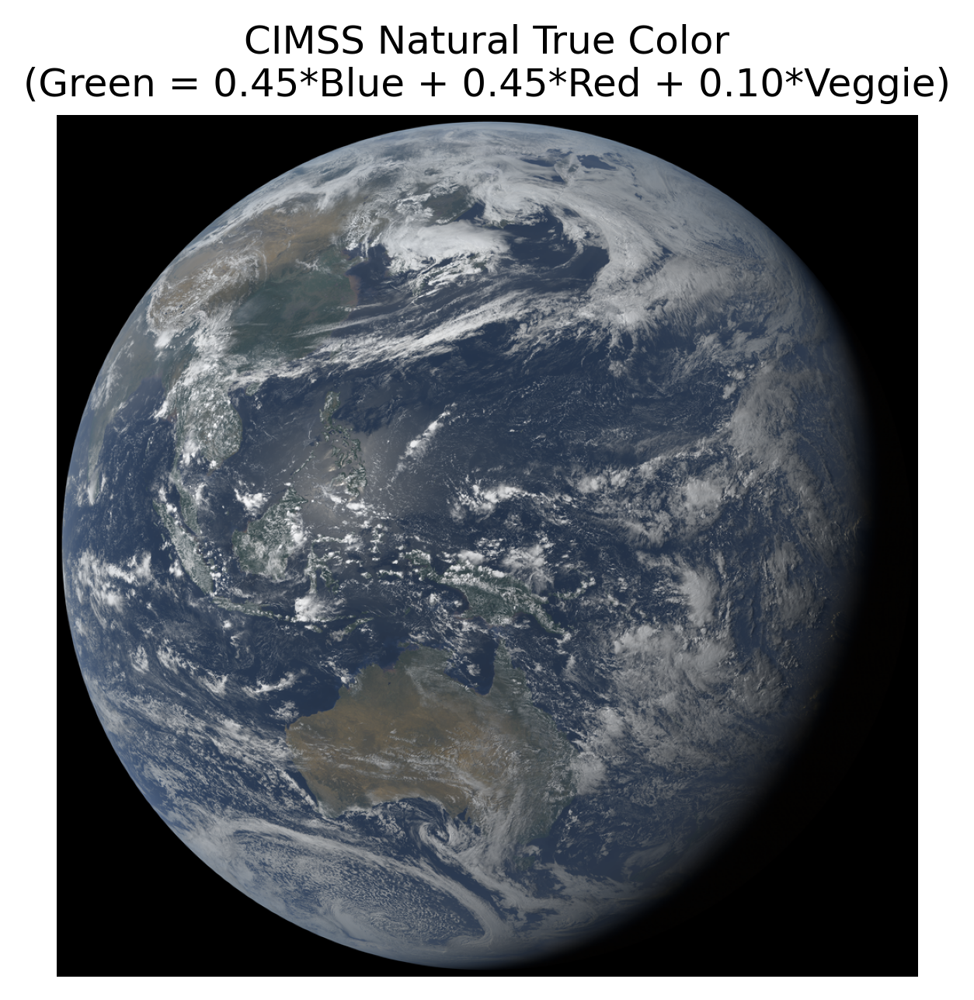

# GOES-green

This repository contains the code used to create a Color Lookup Table for the Himawari-8's green band, based on the intensity values of the blue, red, and veggie bands. Since the GOES Advanced Baseline Imager also includes blue, red, and veggie bands, but not a green band, this LUT can be used to synthesize the ABI's missing green band.

If you want a ready-to-use LUT, you can download it from the [Releases](https://github.com/tralangd/GOES-green/releases) page. Otherwise, the Procedure section below describes how to generate your own LUT from Himawari Standard Data files.


## Procedure

### Requirements

- Docker (or Python 3.14, gdal 3.12, and libjxl 0.11)
- Memory: 24 GB recommended (~18 GB minimum)
- Storage: 500 GB recommended (~50 GB minimum)

### Setup

This setup was developed on Ubuntu 26.04 with Python 3.14, GDAL 3.12.2, and libjxl-tools 0.11.1 installed. In addition, the setup relies on a few non-default Python packages: boto3, datetime, matplotlib, pillow, pillow-jxl-plugin, polar2grid, scipy, and tqdm.

If you wish, you may use the provided Dockerfile to build an Ubuntu container with all the necessary dependencies.
```
docker build -t goesgreen:"latest" . 
```
Then run the container with a persistent storage volume to share a `data` directory between host and container.
```
docker run --rm --interactive --tty --volume "./data":/app/data goesgreen
```

The procedure to create the color LUT is split into multiple python functions, each representing a single step of the overall process. Use the --help option of each python function for specific usage instructions.

### Data Collection

The data collection phase is split into five sequential steps to support downloading, converting, and processing data in batches. In the data collection phase, you can return to the download step at any time to download additional data. 

1. `download.py`
    - Download Himawari-8 Standard Data .DAT files for full disk AHI-L1b-FLDK bands 01, 02, 03, and 04. (Blue, Green, Red, and Veggie Bands, respectively). Supports batch downloading many timestamps in a single run.
2. `convert.py`
    - Utilizes geo2grid to merge HSD segments and convert them to GeoTIFF. Produces one full disk image for each band for each timestamp.
3. `compress.py`
    - Utilize GDAL and libjxl to convert GeoTIFF files to JPEG-XL for more efficient storage.
4. `process.py`
    - Record 4-dimensional histogram data of all new JXL images, and write data to disk in batches.
5. `merge.py`
    - Merge all batched histogram data into a single file.

The data collection process consumes a lot of storage capacity. A utility script, `clean.py`, can be run at any time to scan for files that are no longer needed, and delete them after a confirmation prompt.

>IMPORTANT NOTICE: clean.py is capable of removing JXL files immediately after their histogram data has been processed. You should not actually delete the JXL files until you are satisfied with the results of benchmark.py

### LUT Generation

Once enough data has been collected, run `generate_LUT.py` to collapse the 4D histogram data into a 3D lookup table and write out the result to a file in the `data` folder as `LUT.bin`.

Lastly, the Color LUT can be benchmarked against CIMSS TrueColor Method for generating a synthetic green channel with the `benchmark.py` utility. The script records the deviation from AHI Band 02 (0.51µm 'Green' Band) for each individual timestamp in `results.csv` and reports the average deviation of all timestamps.

### Usage

The Color LUT file is a raw binary 256-by-256-by-256 uint8 array of [b r v] values in column-major order.

For example, in Python:
```
import numpy as np

# Read LUT from file
LUT = np.fromfile("LUT.bin", dtype=np.uint8).reshape(256,256,256)

# read a single LUT value
g = LUT[b,r,v]

# generate a synthetic green channel
# assuming B R V are uint8 arrays with the same dimensions
G = LUT[B,R,V]
```


## Methodology

This section describes on the specific implementations of some steps in the LUT generation process and how they might influence the final results.

### Quantization

The radiance information in the Himawari-8 Standard Data files has 2^11 discretization intervals for Bands 01-04. When converting to image formats, the quantization is reduced to 2^8 intensity levels. For image processing applications, this is sufficient.

### Valid Pixel Data

Pixels with intensities at the upper and lower limits seem to occur disproportionately often, and some intensity levels near the lower end seem to be missing altogether. This was likely caused by logarithmic scaling and clipping during the conversion from radiance to reflectance. Regardless of the cause, pixels with any [b g r v] less than 8/255 or any [b g r v] equal to 255/255 were ignored from the dataset during the data collection process. This was done to ensure the histogram data, recorded as an unsigned 32-bit integer, does not overflow. The missing data will be approximated later when interpolating the LUT.

### Choice of Green Value in LUT

The histogram of green pixels for any given [b r v] triplet follow a highly clustered distribution, with a single peak and a standard deviation that generally gets smaller with more [b r v] samples. Then heuristically speaking, choosing the mean of the green intensities for a given [b r v] triplet would make for a good LUT output. Theoretically, more mathematically intense methods could provide better results, however, the required effort is currently not worth the potential improvement.

### LUT Interpolation

To prevent outliers, LUT entries were only considered valid if there were more than 1000 occurrences of the corresponding [b r v] triplet in the JXL dataset.

The 4D histogram data shows that for most voxels, b≈g≈r≈v. (Visually, this can be seen by the fact that valid LUT entries lie exclusively near the main diagonal of the BRV cube.) Consequently, if follows that g≈(b+r+v)/3. We can use this approximation to extrapolate the LUT from only valid entries to the full BRV intensity cube. Specifically, we can assign boundary conditions g=(b+r+v)/3 along the 12 edges of the cube, then linearly interpolate the remaining non-valid entries.

Regarding linear interpolation, we take a shortcut that dramatically speeds up the process. Rather than performing 3D interpolation on the interior of the cube, we instead perform 2D interpolation along slices of the cube in the xy, xz, and yz planes. Then take the average of the three results. Lastly, we apply a 3D Gaussian Blur to smooth any jarring discontinuities. Overall this method provides an adequate compromise between speed and performance. But again, better results could theoretically be achieved with more patience and mathematical rigor.


## Results

The LUT used here was generated from a dataset containing Himawari-8 images from the 1st, 6th, 11th, 16th, 21st, and 26th of each month of the year 2021 at times 20:00, 23:00, 02:00, 05:00, and 08:00 UTC+00 (approximately 6:00am, 9:00am, 12:00pm, 3:00pm and 6:00pm local time at longitude 140 degrees East).

The comparison images shown below were taken by Himawari-8 at 2021-05-01 05:00 UTC+00:00.






## Resources

- [Amazon AWS S3 Web Explorer for Himawari-8](https://noaa-himawari8.s3.amazonaws.com/index.html). AWS Bucket Documentation [here](https://registry.opendata.aws/noaa-himawari/) and specification for Himawari Standard Data files [here](https://www.data.jma.go.jp/mscweb/en/himawari89/space_segment/hsd_sample/HS_D_users_guide_en_v13.pdf) (PDF). The full disk data files are partitioned and compressed into ten segments based on latitude, as seen in [this figure](https://www.data.jma.go.jp/mscweb/en/himawari89/cloud_service/cloud_service.html#Figure1).
- [Geo2Grid Homepage](https://www.ssec.wisc.edu/software/geo2grid/index.html) and [GitHub Repository](https://github.com/ssec/polar2grid)
- [GDAL Homepage](https://gdal.org/en/stable/)
- [JPEG-XL Reference Implementation on GitHub](https://github.com/libjxl/libjxl)
